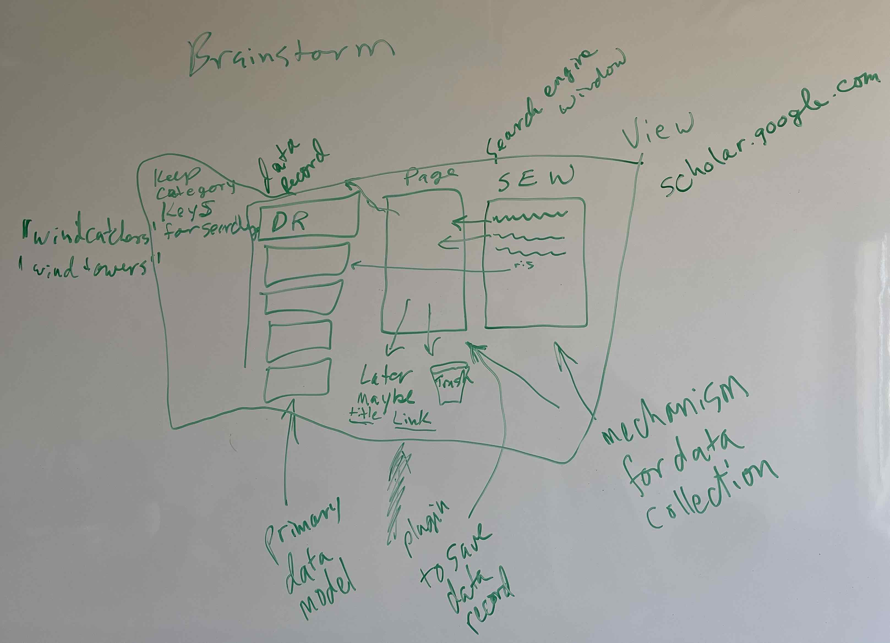

# Search Engine Collect Window

Per Brainstorm with Eric Martinez March/April 2024 at One Love

Qt 5/6?

On the right, Qt Browser window on the right, middle column stack of label objects* containing RIS data  pointers with just author and title?? on the list stacks of dragged "chosen" objects,  (1..111) bottom "maybe later" junk folder and trash can... put picture in this .md file....

need to start with loaded ris file in stack to drag and drop into chosen, maybe later folder and trash bin... later add search browser.   "on click" open external browser to view page... "on right click", have right click list, including get ris data into popup, copy ris data to ris column on left, copy ris data to clipboard, copy link to clipboard, open link to external browser....

\* stack of label objects generated dynamically via reading from file, database, or during dynamic app run, so cannot be created via qtdesigner etc... 

